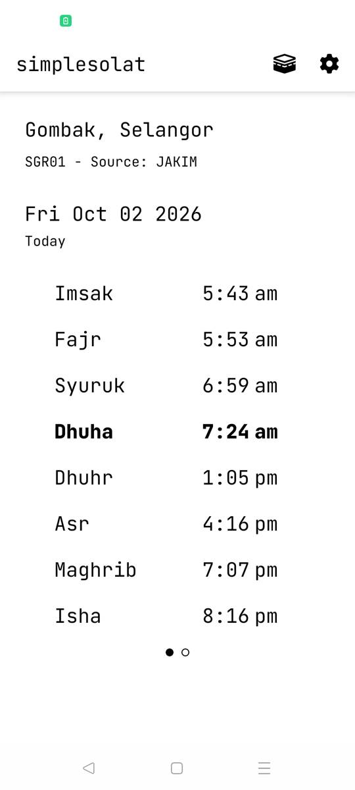
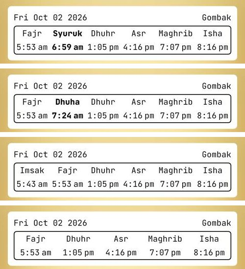
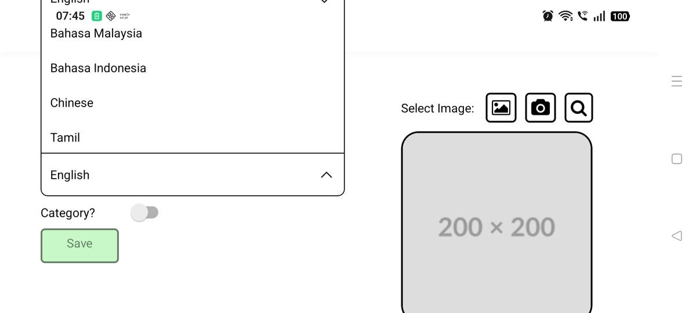
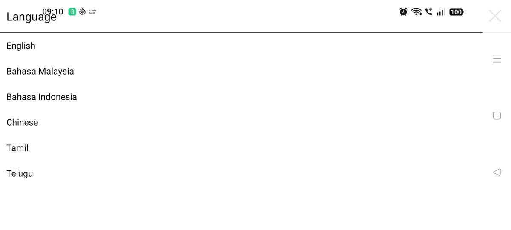
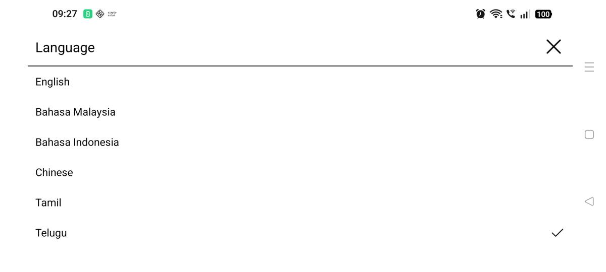

*This is part four of a short series on working with Claude Code from a
remote workspace. [Part one](/writing/a-workspace-that-keeps-working/) is why
the work moved off my laptop, and [part three](/writing/giving-the-workspace-a-browser/)
gives it a browser.*

For most of the time I've had GibTalk and simplesolat, making a release has
gone like this. I'd open my laptop, build a development version of the app on
Expo's servers, install it on my phone, and connect it to the dev server on
the laptop with `npm start`. Those development builds take a while, and I'd
sit at the laptop waiting for them. When I was happy, I'd bump the version,
start a release build, wait again, download it, and upload it to Google Play
and the App Store by hand. Then came the click-through: the release notes,
the rollout, the store listing.

None of it is hard, but every mistake costs time. Forget to bump the version
or the build number, and the store rejects the upload: change it, build
again, wait again. Forget the release notes on iOS, and the only way to fix
them is another release, and another review.

Then I moved my development into a [Coder](https://coder.com) workspace,
a machine on my own server that I reach from a browser. Claude Code runs
there, and keeps running when I close the laptop. But my phone couldn't
reach a dev server on it the way it reached my laptop, the workspace wasn't
logged in to Expo, and only GibTalk had ever been set up to upload builds to
a store. At the end of September, when a backlog of small fixes came up, I
told Claude Code: "I don't have dev flow set up for mobile dev yet."

It started on a Thursday morning with a question about how releases work.
By the next morning, both apps had been fixed, released, given new features
and tested on a real phone, and I hadn't clicked through a single store page.

## A crash on open

The day before, a simplesolat user had emailed, in Malay, to say the app
crashed as soon as they opened it. Clearing the app's data fixed it, but
neither of us knew why.

On Thursday morning I asked how releases worked again, and Claude Code logged
in to Expo's build service from the workspace. Even that took a small trick:
the login opens a browser and sends you back to a `localhost` address, which,
on a remote machine, is a page that doesn't load. I pasted the address it
landed on, and Claude Code finished the login by requesting it from the
workspace itself.

Then I pasted in the crash reports from the Play Console.

The top simplesolat crash, 43 crashes from 11 users and almost all of its
crashes, was a `BadParcelableException` inside
[notifee](https://github.com/invertase/notifee), the library that schedules
the prayer reminders. notifee stores each scheduled notification in Android's
own binary format, and reads them all back when the app asks for the list.
That format isn't guaranteed to read back, and on some phones it didn't.
Claude Code took notifee's compiled Android library apart to check which of
its calls read that data back and which didn't, then changed the app to ask
only for the reminders' ids, stored their details as plain text, and gave the
ids a version, so old entries get cleared on the next start
([#15](https://github.com/ragibkl/simplesolat/pull/15)). That matched the
email: an app that crashes while reading its own saved reminders, until you
clear its data.

A test build went to my phone first. I used it for half a day, and told
Claude Code: "I've been using the apk. stable."

## Handing over the releases

Building was solved, but the releases were still mine to click through. So I
said: "It's not just submit. I also want to give you access to do releases."
The release process has always been the tedious part for me, with all those
places to slip.

Claude Code walked me through creating a service account in Google Play and an
API key in App Store Connect, and which permissions each one needed. I put the
key files on the workspace. It wired them into Expo's upload command through
environment variables, so no key or path went into either repository, wrote
two small helper scripts for the store APIs, and tested each key with a
read-only request first. The App Store key was refused at first, because I
hadn't accepted an updated Apple agreement. About four minutes after I did,
it worked.

simplesolat 1.1.2 went out to everyone on Google Play, with the crash fix.
Some of the store links still pointed at the app's old GitHub Pages site, and
now they point at [simplesolat.com](https://simplesolat.com). It writes
better release notes than I do, too.

Every upload went to the store as a draft, and nothing reached users until
I said "Proceed", or "full release simplesolat". That wasn't a rule I'd set
on purpose. I'm still working out how much to hand over. After a few more
releases, I might let it roll one out on its own, but only with enough review
and testing behind it.

## Dhuha, because someone asked

With the release out, I wanted to talk about features. The first one had come
from a Play Store review in September, written in Malay: the reviewer liked
the app, found it easy to read and said it had the information they needed,
and asked for just one more thing, the time of *dhuha*, the mid-morning
prayer. I'd replied that I'd work on it.

So I asked for dhuha, and a settings page to check the app's permissions and
turn individual reminders on and off.

Dhuha turned out to be a small lesson in the rule I'd set for simplesolat:
official times, or nothing. JAKIM publishes a dhuha time, and so does
Brunei's KHEU, but the other countries' sources don't. JAKIM's is a fixed
number of minutes after sunrise, except the number changes by zone: 25 minutes
in Selangor, 28 in Kelantan and Sabah. So it can't be worked out with one
rule. I wondered about calculating it where there's no official time, and then
said: "Wait, I think don't even calculate." The app shows dhuha where an
authority publishes it, and nowhere else.

*Dhuha in Gombak, on the test phone. Claude Code took this screenshot.*

I still struggle with the balance. I want the app to be simple, without a page
of settings you have to get right. But it's better to show no answer than a
wrong one.

The widgets got one setting instead of another widget: an extra time to show,
Imsak, Syuruk, Dhuha or none. The old widget with Imsak is now hidden from
Android's widget list, using a small build setting, so anyone who already
has one on their home screen keeps it.

## A phone on Wi-Fi

To test all that, I'd normally install the build on my phone and tap through
it myself. The workspace has no hardware virtualisation, so an Android emulator
would be far too slow to be useful. Claude Code suggested a cloud device
service. I asked: "Could I attach a test device to you?" Then: "Can we do test
device via wifi? Guide me?"

Android can be debugged over Wi-Fi. Early on Friday morning, I turned on
wireless debugging on a spare phone, and read out the pairing code it showed.
The workspace couldn't reach my home network directly, but there was already
an SSH path that could, so the debugging connection went through that: no
cable, no laptop, and no new openings in my network.

Then I watched my phone being used by something that wasn't me.

The first install was slow. The test build was 104 MB, and it took about ten
minutes to go through the tunnel and over Wi-Fi. Then it sat on a screen I
didn't know about: this brand of phone asks you to confirm installs from a
debugger, and the install waited for a tap. Claude Code took a screenshot,
saw the prompt and tapped **Install**.

After that, it went through the app the way a tester would. It finds buttons
by reading the screen's layout, so once, looking for an **Allow** button, it
tapped a dialog title that also had "Allow" in it, noticed, and tapped the
button. It turned on each permission, opened the new settings page, and sent
a test notification, which arrived. Then it checked something I'd never have
thought to check by hand: the list of alarms Android had scheduled. Only
today's remaining prayers were there, Dhuhr at 13:05, Asr at 16:16, Maghrib at
19:07 and Isha at 20:16. It turned Asr off, and the 16:16 alarm disappeared.
It turned it on, and the alarm came back.

It opened the widget list and confirmed there were three simplesolat widgets,
with the old Imsak one hidden. It placed a real widget on the home screen.
The widget is drawn as an image, so its text can't be read from the screen's
layout. It switched the setting through all four options and read each one
from a screenshot instead. Finally it read the crash log: nothing.

*One real widget, photographed by Claude Code in each of the four settings.*

It didn't replace my own testing, though. When I'd tried the new settings
page myself, I'd sent a screenshot: the switches had teal knobs, in an app
that's otherwise black and white, and the widget options wrapped badly. Those
got fixed. The automated test checks that things work; using the app myself
checks how it feels. The two complement each other.

## GibTalk, on the same phone

GibTalk went through the same day, with two differences: it's on the App
Store too, and it runs on tablets, in landscape.

Its top crash, "Already resumed", came from inside Expo. The line numbers in
the report matched one exact version of an Expo library, and a later patch
had added a guard for it. Updating Expo's patch versions fixed it
([#33](https://github.com/ragibkl/GibTalk/pull/33)). While looking for
GibTalk's other crashes, Claude Code found a real bug of mine: restoring a
backup, or adding a template, while you were inside a folder put the whole
board inside that folder. A template could even end up containing itself
([#34](https://github.com/ragibkl/GibTalk/pull/34)). The test build went to my
phone and my tablet.

GibTalk 1.0.18 went out on Google Play, and Claude Code prepared the App
Store version entirely through the API: the "What's new" text, the build, the
support, marketing and privacy links, and the submission for review. Apple
wants a support page with a way to contact you, so both apps' websites got
one, and GibTalk's store links moved from its old address to
[gibtalk.com](https://gibtalk.com).

On the spare phone, Google Play Protect asked to upload the GibTalk test build
for scanning, and Claude Code chose **Don't send**. Then, with the phone on its
side: a template added inside a folder landed at the top level, a restore
inside a folder worked, an old backup with the old code for Telugu now showed
Telugu, and the credits link opened gibtalk.com.

It also found something I hadn't noticed, in a screenshot taken while
checking that Telugu was in the list. In landscape there's little room below
the language picker, so its list opens upwards, and it ran under the phone's
status bar. English, the first option, was hidden until you scrolled. It's an
old problem, not one of the new changes.

*Before: the list opens upwards, and English is hidden under the status bar.*

Fixing it took two rounds, each one a build in Expo's cloud, an install on the
phone and a screenshot, about 15 to 20 minutes a round. The first round showed
the languages as a full-screen list instead
([#36](https://github.com/ragibkl/GibTalk/pull/36)). All six languages were
visible now. But the screenshot showed the list's own title and close button
drawn under the status bar, and its right edge under the navigation bar: the
same cause, one level down.

*Round one: every language is visible, but the title runs into the clock.*

The code had checked out fine. Only the real phone showed it. The second round kept the list clear of the system bars
([#37](https://github.com/ragibkl/GibTalk/pull/37)). This time the
screenshot showed the title below the status bar and every language in
view, and picking one still worked.

*Round two: clear of the status bar and the navigation bar.*

Even that round had a slip: the new build didn't come to the front when it launched, so the first taps landed on the
screen that was open before. It noticed from the text on screen, opened
GibTalk again and repeated the check. Both fixes go out in the next GibTalk
release.

From connecting the phone to finishing both apps' first tests took about 45
minutes, including the slow first install.

What got me wasn't any single step. It was that it could install the apps,
plan the whole test, and work through it, screen by screen, with screenshots.
The alarms, the widget list and the crash logs were things I hadn't even
considered checking. It's quite surreal to see a phone navigate itself in
front of you.

## What it still needs from me

Claude Code sees the phone through screenshots, not a live screen, so it's
slower than a person tapping through. I still had to turn on developer
options, start wireless debugging and read out the pairing code. And the
testing is all Android. I don't have an iPhone, only an old iPad, and I
haven't worked out how to do the same for iOS yet. I'd like to.

On cost: I've hit the limits on the Pro plan before. On the Max plan, I
haven't yet. I think it's worth it. Done by hand, this would have waited for
evenings at my laptop, one fix at a time, and with this many things in
flight, that's weeks. Here it took about a day, and most of it happened while
I was doing something else.

Now the work goes on without me. The workspace waits for the builds and does
the release. I check in later from the Claude app on my phone, download the
test build when it's ready, and try it. I spend much less time on it, and
most of that time is spent using the app, not releasing it.
